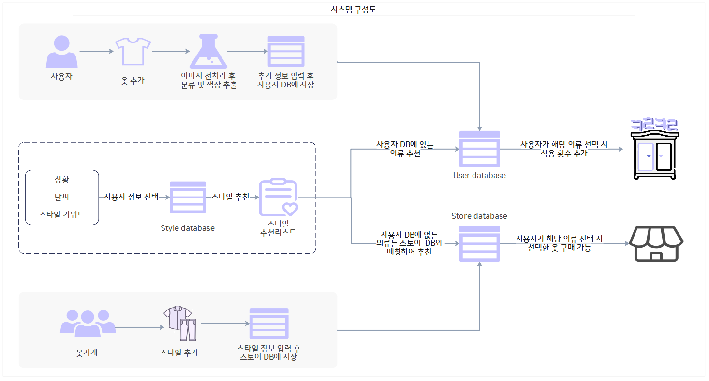
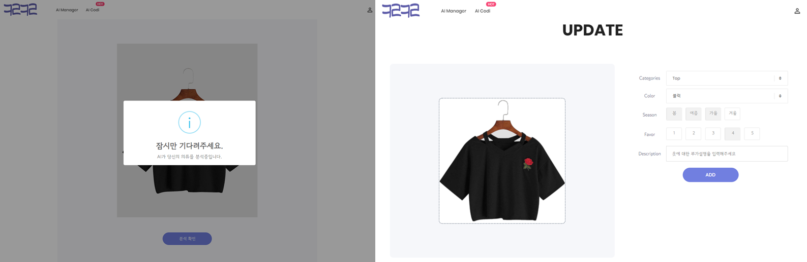
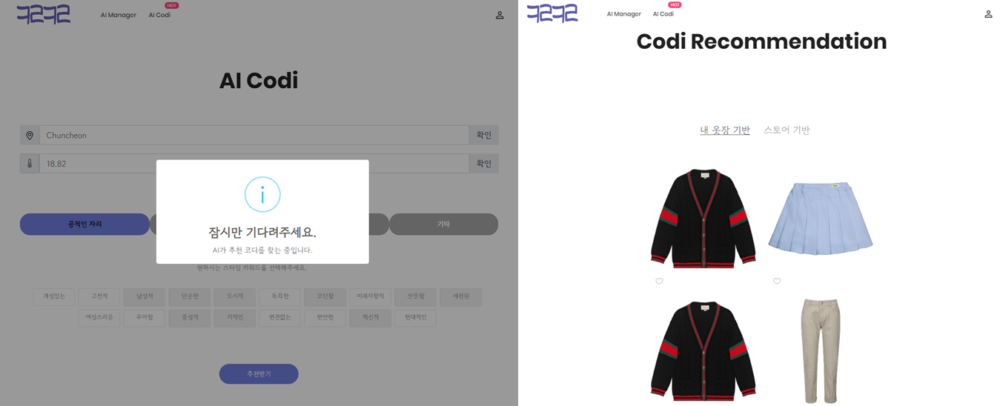
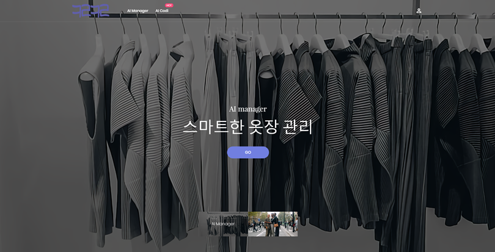

# finalPJT_ClosetCloud

## [프로젝트 개요]

### 1.1. 문제 정의 및 목적

- 온라인 시장이 확대됨에 따라 소비자들은 더욱 개인화된 추천 서비스에 대한 요구가 커지고 있음에도 수많은 소비자를 개별적으로 대응할 수 없음

### 1.2. 주제

- 카메라로 촬영한 옷들을 DB에 저장하고 이를 기반으로 선택한 스타일에 따라 옷을 추천해주는 개인별 맞춤 스타일링 정보 제공 웹/앱 서비스 개발

## [팀 구성]

| 역할 | 이름   | 수행 내용                                                    |
| ---- | ------ | ------------------------------------------------------------ |
| 팀장 | 김유정 | 전반적인 프로젝트 관리 (일정, 수행방안 등) 노션 및 Github 관리 데이터 전처리 분류 모델 구성 및 테스트(MobileNet, ResNet50) 스타일 추천 시스템 구성 및 테스트 모델 성능 개선 웹/앱 화면 구현 |
| 팀원 | 이지현 | 팀장 부재 시, 팀장 역할 대리 수행 진행 내역 정리 및  보고 자료 작성 분류 모델 구성 및 테스트(VGG16, ResNet101) 모델 성능 개선 이미지 입력 구축 |
| 팀원 | 손지원 | 데이터 정리 스타일 추천 시스템  구성 및 테스트 모델 성능 개선 서비스 화면 UI/UX 설계 웹 프레임워크(Flask) 구현 기상 정보 API 구현 |

## [기능]
### 2.1 시스템 구성도

### [2.1. AI 옷장 관리](https://github.com/sara4kyj/finalPJT_ClosetCloud/blob/80a87b26f639850c02b86a679666450c000488cf/04_flask/cloth_image_preprocessing.py)

- OpenCV를 사용하여 촬영한 사진의 배경 제거를 통해 의류 색상 추출 및 분류 정확도 향상 
- K-mean cluster를 사용하여 최빈값을 가진 색상 반환 
- MobileNet 모델을 사용하여 상의/하의/원피스/아우터 자동 분류 
- 의류의 계절성(한 옷을 여러 계절에 착용)를 반영한 계절(Season) 다중 선택 가능하도록 반영 
- 스타일링 추천 시 사용할 선호도(Favor) 입력

### [2.3. AI 스타일링 추천](https://github.com/sara4kyj/finalPJT_ClosetCloud/blob/80a87b26f639850c02b86a679666450c000488cf/04_flask/recommend.py)

- 사용자 제공 정보와 사용자 옷장 내 선호도를 반영한 컨텐츠 기반 필터링을 통해 개인별 맞춤 스타일링 제공
  → 사용자 입력 정보 : 현재 위치에 따른 온도, 상황, 스타일 키워드

## [프로젝트 결과]

https://youtu.be/IU63oEg1n6s